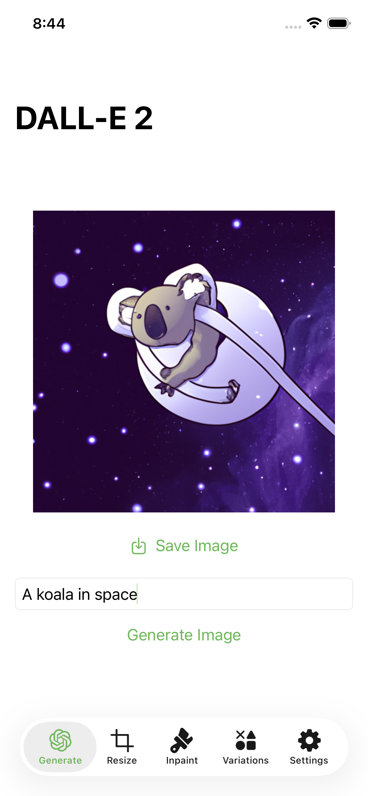
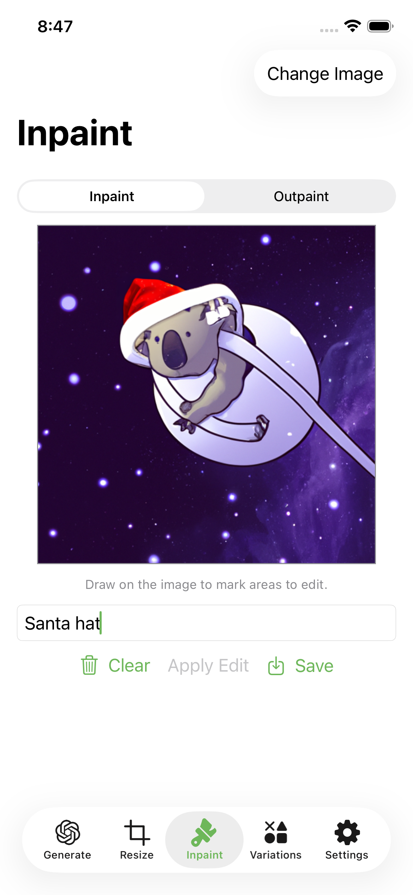
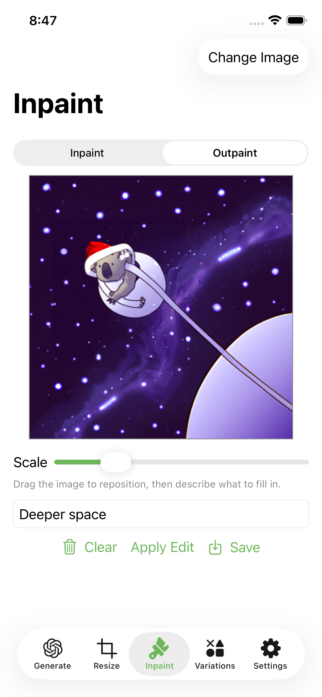
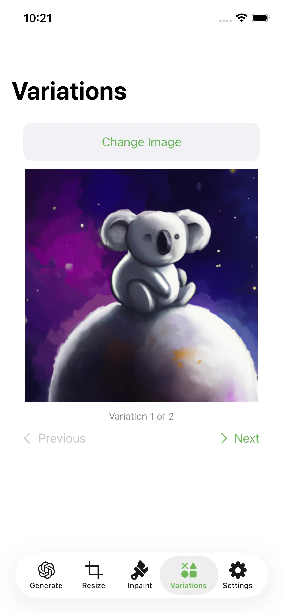
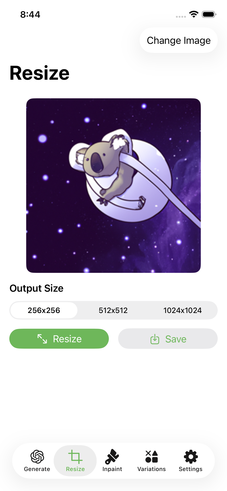

# 🖍️ DALL-E-2-SwiftUI: Getting Started
## You'll need these prerequisites:
- An OpenAI API Key
- Xcode and a device/simulator running on at least iOS 17+
## Steps
1. Clone the repo:
```
git clone https://github.com/neonforestmist/DALL-E-2-SwiftUI.git
```
2. Copy `.env.example` to a new file called `.env` in the project root and paste your OpenAI API key:
```
OPENAI_API_KEY=sk-your-api-key-here
```
> **Tip:** `.env` is a hidden file. If you don't see it in Finder, press **⌘ Cmd + Shift + .** to toggle hidden files.

3. Build + run the project! 🎉

## What it can do:
### Once given a valid api key, it can:
* Receive traditional image prompts:
  
  <br/>
* Inpaint (via drawing on parts of the image to edit):

  <br/>
* Outpaint (via being able to "zoom" out of an image and describe how the image should be filled):

  <br/>
* Variations (making variations of an existing image):

  <br/>
  > **Note:** The variations endpoint can be unstable on OpenAI's side and may occasionally return server errors.

* You can also natively resize your images saved on your device to be able to use it with Dalle.

  <br/>
## Cost per generation
> Table derived from OpenAI pricing.

| Model | Quality |256 x 256| 512 x 512 | 1024 x 1024 |
|:--------:|:--------:|:--------:|:--------:|:--------:|
| dall-e-2 | Standard | $0.016 | $0.018 | $0.02 |
